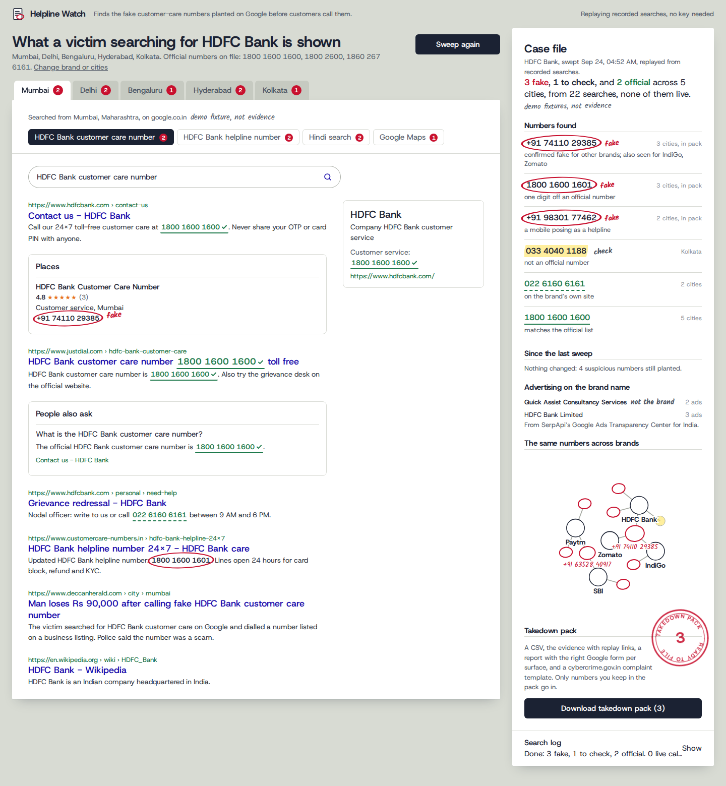
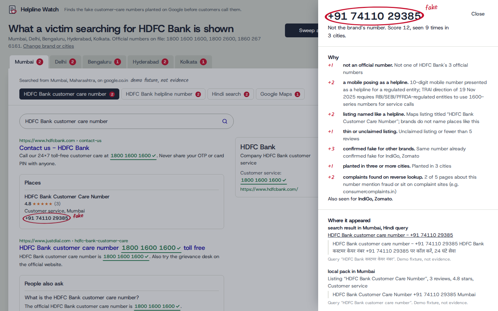
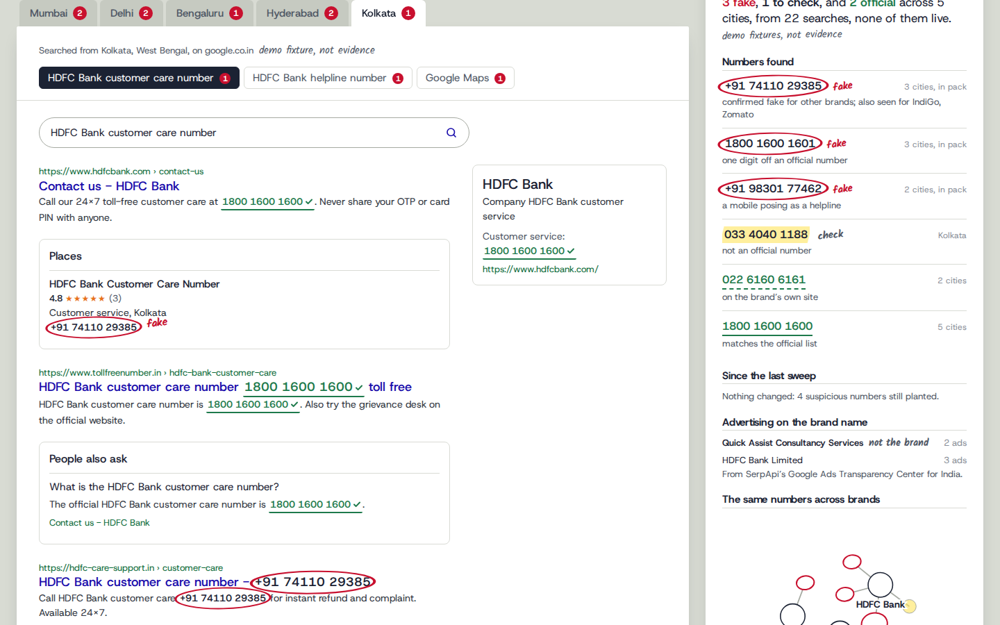
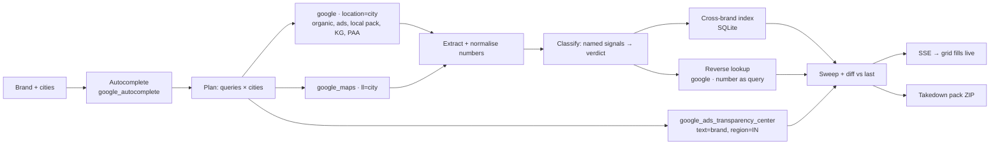

# Helpline Watch

**Finds the fake customer-care numbers scammers plant on Google Search, Maps and ads, city by city, before customers call them.**

Built for the [SerpApi India Hackathon 2026](https://serpapi.github.io/serpapi-india-hackathon-2026/) · track: Knowledge & Public Interest · [3-minute demo video](#demo-video) · [`make verify`](#verify-it-yourself) runs the whole proof with no API key.



## The problem

When someone in India needs their bank, food-delivery app or airline, they google "*brand* customer care number" and call the first number they see. Scammers know this. They plant mobile numbers in Google Maps listings named "HDFC Bank Customer Care Number", buy search ads with one-digit-off helplines, and seed aggregator pages, and they do it per city, so a fraud analyst sitting in Mumbai never sees what a victim in Patna is shown.

- By March 2026 the Indian Cyber Crime Coordination Centre had logged **1.73 lakh complaints** under this modus operandi, with losses over **₹2,100 crore**; five regions account for 61% of incidents ([summary](https://righttoinformation.wiki/fake-customer-care-number-scam-india), secondary source).
- All cyber fraud reported on the national portal: **₹55,050 crore across 65.89 lakh complaints** as of July 2026 ([Ministry of Home Affairs, via The420](https://the420.in/india-55659-crore-cyber-fraud-6-59-million-complaints/)).
- Named cases: a Bengaluru man lost ₹90,000 [calling a fake bank number found on Google](https://www.deccanherald.com/amp/story/india%2Fkarnataka%2Fbengaluru%2Fscammers-loot-man-of-rs-90k-after-he-calls-dubious-bank-phone-number-895534.html); four people were defrauded through a fake number [on a sweet shop's Maps listing](https://www.deccanherald.com/amp/story/india%2Fkarnataka%2Fbengaluru%2Fbig-mishra-pedha-latest-to-be-hit-by-cyber-scam-1155452.html); Zomato went to the cyber police [over a fake helpline](https://www.tribuneindia.com/news/archive/haryana/zomato-moves-cyber-police-over-its-fake-helpline-817573).
- Regulators are moving: TRAI's [direction of 19 November 2025](https://www.trai.gov.in/direction-regarding-phase-wise-implementation-mandatory-adoption-1600-series-numbers-rbi-sebi-and) makes 1600-series numbers mandatory for RBI/SEBI/PFRDA-regulated entities' service calls, which is exactly the kind of rule a classifier can use.

Today the sweep is a person with a spreadsheet, googling from their own desk, missing Maps and ads, and unable to see other cities. Helpline Watch does it in one click and hands the analyst a takedown pack.

## What it does

1. **Plans** the queries victims actually type, using Google Autocomplete, in English and Hindi.
2. **Sweeps** every surface per city through SerpApi with the `location` parameter: organic results, knowledge panel, answer box, People-also-ask, local pack, Maps listings, search ads, and the Ads Transparency Center for advertisers bidding on the brand name. Each page comes back as a snapshot and is rendered as the printout a victim in that city was shown, with the verdicts marked in place.
3. **Extracts and normalises** every Indian phone number (mobile, landline, 1800/1860/1600 series, Devanagari digits) and compares each against the brand's official list.
4. **Scores** each number with named, weighted signals and gives a verdict: `official`, `official (unlisted)`, `needs review`, or `fake`. No language model anywhere in the verdict path.
5. **Corroborates** across brands: the same number posing as HDFC Bank, Zomato and IndiGo is one operation, drawn as a network.
6. **Reverse-checks** the top suspects by searching the number itself for complaint pages.
7. **Diffs** against the brand's previous sweep: new, persisting, gone.
8. **Builds the takedown pack** the analyst files: CSV, evidence JSON, a report with a replayable SerpApi archive link per sighting, the Maps place link, the right Google report form per surface, and a cybercrime.gov.in complaint template. Nothing is filed automatically; a person keeps or removes every finding.





## Quickstart (no API key needed)

Requires Python 3.11+ and [`uv`](https://docs.astral.sh/uv/). Node is only needed if you change the UI.

```bash
make setup     # venv + backend install
make demo      # seeds five brands from recorded fixtures, serves http://127.0.0.1:8787 and opens it
```

Then click **Sweep again**, watch the sheets fill city by city, click a circled number, and download the pack. `make verify` prints the proof:

```
  PASS  shared planted number is FAKE  · score=12
  PASS  shared number linked across brands  · other_brands=['IndiGo', 'Zomato']
  PASS  one-digit lookalike is FAKE without complaint evidence
  PASS  official number republished by a third party stays OFFICIAL
  PASS  unlisted number on the brand's own domain is OFFICIAL_UNLISTED
  PASS  unknown landline in a news story stays REVIEW
  PASS  number inside an impersonating ad is FAKE
  PASS  takedown pack has csv, evidence, report and complaint template
  PASS  takedown pack contains only confirmed fakes  · rows=3 fakes=3
  PASS  partial coverage is reported, not hidden  · kolkata 2/3
  PASS  no live SerpApi calls were needed
RESULT: PASS
```

### Go live

```bash
cp .env.example .env        # add SERPAPI_API_KEY
make record                 # sweeps every seed brand live and records the responses as fixtures
make demo
```

Every request is keyed by its parameters, so `make record` replaces the synthetic fixtures in place and the UI badge flips from "synthetic fixtures" to live. One sweep of one brand across five cities is about 22 searches, plus up to 6 reverse lookups, so the free plan's 250 searches a month covers roughly ten sweeps; `HELPLINE_MAX_CALLS` caps each sweep, and the health endpoint shows credits left.

## How it works



**Signals** (`backend/helpline_watch/analysis/classify.py`), fake at a score of 3 or more:

| signal | weight | what it means |
|---|---|---|
| NOT_IN_OFFICIAL_LIST | +1 | baseline for any number not on the analyst's list |
| LOOKALIKE_OF_OFFICIAL | +3 | one digit or one swap away from an official number |
| MOBILE_AS_HELPLINE | +2 / +1 | a 10-digit mobile presented as a helpline; +2 for regulated entities (TRAI 1600-series direction) |
| LISTING_NAMED_AS_HELPLINE | +2 | a Maps listing titled like "X Customer Care Number" |
| THIN_OR_UNCLAIMED_LISTING | +1 | unclaimed listing or under five reviews |
| CROSS_BRAND | +3 | the same number seen posing as another brand in an earlier sweep |
| MULTI_CITY | +1 | planted in three or more cities |
| AD_FROM_NON_OFFICIAL_DOMAIN | +2 | shown inside a search ad from a domain the brand does not own |
| SCAM_WORDS_IN_CONTEXT | +2 | the surrounding text already says fraud, scam, fake |
| REVERSE_LOOKUP | +2 | pages about the number mention fraud or sit on complaint sites |

Official matches and numbers found on the brand's own domain short-circuit to green. Everything between 1 and 2 goes to a review queue that never reaches the pack on its own.

**Layout**

```
backend/helpline_watch/
  plan.py            the exact SerpApi calls a sweep makes (deterministic)
  serp/client.py     thin client: live / replay / auto, fixtures keyed by params, credit budget
  extract/phones.py  Indian number extraction + normalisation
  extract/surfaces.py  parsers for google, google_maps, ads transparency, reverse lookups
  analysis/classify.py signals → verdict
  sweep.py           orchestrator streaming SweepEvents
  store.py           SQLite: sweeps, cross-brand index, network
  takedown.py        the ZIP the analyst files
  api.py · cli.py    FastAPI + SSE, and the `helpline-watch` command
backend/fixtures/    recorded or synthetic SerpApi responses
frontend/            Vite + React + Tailwind, built into the Python package: the desk, sheets, marks, case file, evidence slip
docs/adr/            four decisions, docs/DESIGN.md, docs/UI-SPEC.md, docs/demo-script.md
```

## Meaningful SerpApi usage

| SerpApi feature | role in the product | what it would cost to replace |
|---|---|---|
| Google Search API with `location`, `google_domain=google.co.in`, `gl=in`, `hl=hi` | see the SERP a victim in each city sees, including Hindi queries | a residential proxy network per city |
| Google Maps API with `ll` | the listings that carry most planted numbers, with `phone`, `reviews`, `unclaimed_listing`, `place_id` | scraping Maps, which breaks weekly |
| Google Ads Transparency Center API (`text`, `region=2356`) | who is bidding on the brand name in India | manual browsing of the transparency center |
| Google Autocomplete API | the query variants victims actually type | guesswork |
| `ads`, `local_results`, `knowledge_graph`, `answer_box`, `related_questions` blocks | every surface a number can hide in, parsed from one response | separate scrapers per block |
| `search_metadata.id` and the Search Archive | a replayable evidence link for every sighting, valid 31 days | screenshots |
| the full response blocks per call | the printout itself: every page is redrawn from SerpApi's JSON, in Google's order, so the analyst sees what the victim saw | nothing comparable |
| Reverse lookup: the number as the query | complaint pages and other brands the number poses as | nothing comparable |

## What is real and what is simulated

- **Real:** the pipeline, the parsers (written against SerpApi's documented response shapes), the classifier, the store, the pack, the UI, the tests, `make verify`.
- **Recorded from SerpApi when you run `make record`.** Until then the repo ships **synthetic fixtures**, generated by `backend/scripts/make_synthetic_fixtures.py`, in the exact response shapes. They are labelled `synthetic` in every file and in the UI, never carry an archive link, and their phone numbers are made up. The demo world is designed to show two different kinds of fake (a shared planted mobile and a one-digit lookalike), two kinds of not-fake (an official number republished by an aggregator and an unlisted number on the brand's site), a review case, and a deliberate coverage gap for Paytm in Kolkata.
- **Official numbers in `backend/seeds/brands.yaml`** were transcribed from public support pages and must be verified by the analyst; the app treats that list as ground truth and lets you edit it from a finding.

## Verify it yourself

```bash
make test      # 39 unit + API tests (parsers, classifier, store, SSE stream, pack, patching)
make verify    # end-to-end replay with 11 assertions, prints PASS/FAIL
make eval      # the per-brand table: numbers found, fake, cross-brand, review, calls
make lint      # ruff · oxlint · tsc
```

## Limitations

- The classifier's precision is bounded by its signal set; that is why a `review` queue exists and why the pack is gated by a person. Live precision has not been measured yet because no key was available at build time; `make record` followed by `make eval` produces the table for real data.
- Numbers inside images (a common scam tactic on Maps photos) are not read; Google Lens or an OCR pass is the obvious next signal.
- Official numbers must come from the analyst; the app suggests additions when it finds numbers on the brand's own domain but does not crawl the site.
- One sweep per brand at a time; a scheduler for weekly re-sweeps is a cron line away but not included.

## Demo video

Link goes here before submission (unlisted YouTube, opens in an incognito window). Shot list in `docs/demo-script.md`.

## AI disclosure

See `AGENTS.md`. Built with Claude Code; no model runs inside the product.

## License

MIT.
